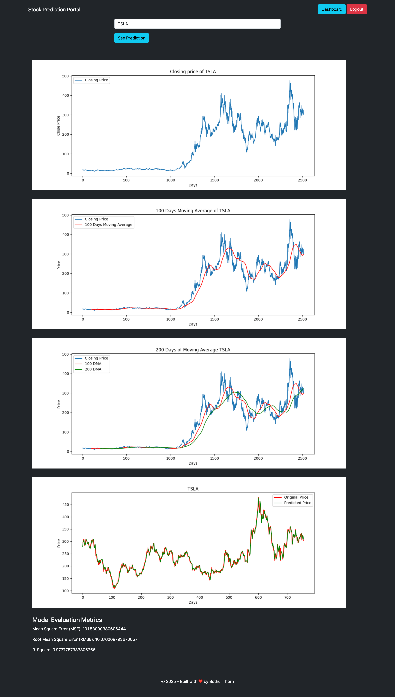

# Stock Prediction Portal

The **Stock Prediction Portal** is a full-stack web application that demonstrates how to use
machine learning models to analyze stock market data and forecast future trends.  
It combines a **React-based frontend** with a **Django backend** and an **LSTM (Keras/TensorFlow) model** for stock price prediction.

---

## Features

- **LSTM-based Stock Prediction**  
  Predicts stock prices using a recurrent neural network (LSTM) trained on historical data.

- **Technical Indicators**  
  Automatically calculates **100-day** and **200-day simple moving averages (SMA)**,
  which are popular in technical stock analysis.

- **Full-Stack Integration**

  - **Frontend:** React
  - **Backend:** Django REST Framework
  - **Machine Learning:** TensorFlow/Keras

- **Data Pipeline**
  - Fetches historical data via **yfinance**
  - Cleans and preprocesses data with **Pandas/NumPy**
  - Visualizes trends and predictions with **Matplotlib** on the backend and custom charts in React

---

## Tech Stack

**Frontend**

- React
- JavaScript
- Axios (API communication)

**Backend**

- Python
- Django & Django REST Framework

**Machine Learning**

- TensorFlow / Keras
- NumPy / Pandas
- Matplotlib
- yfinance

## Screenshot

